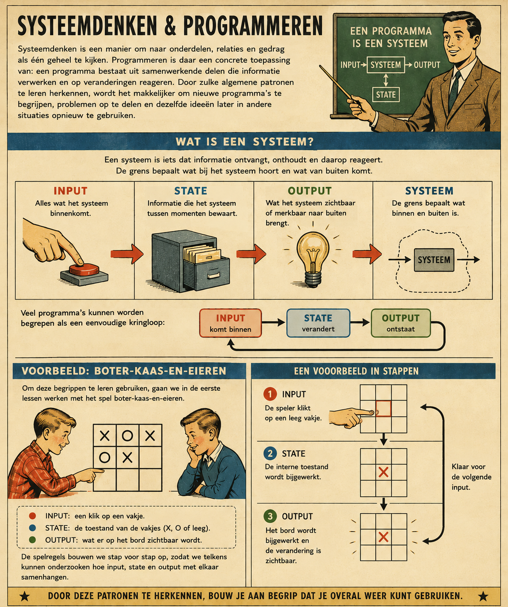
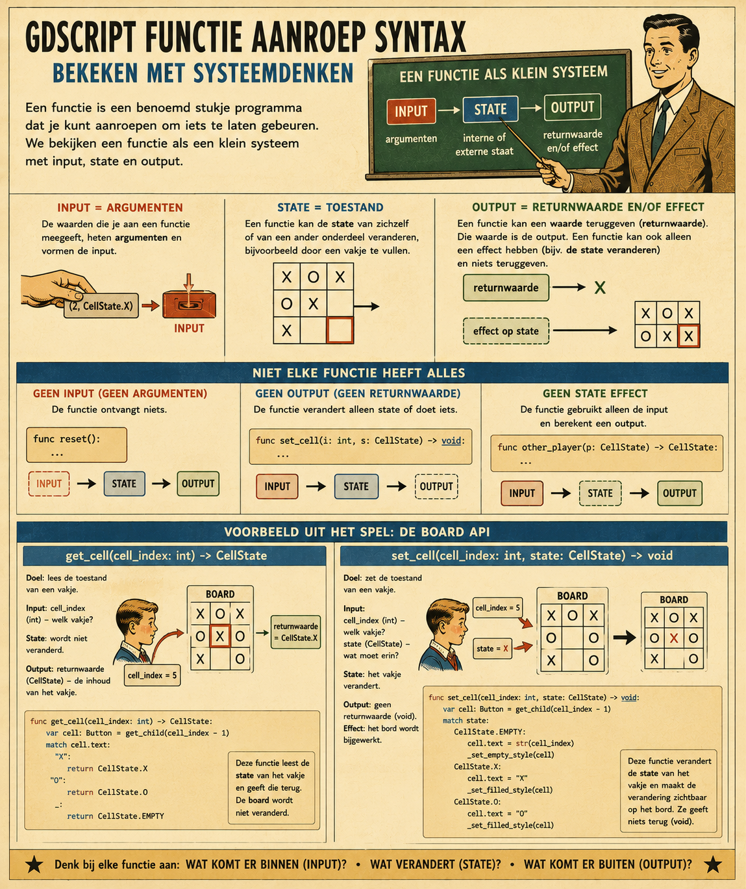
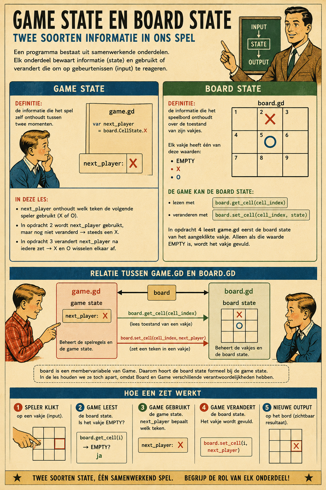
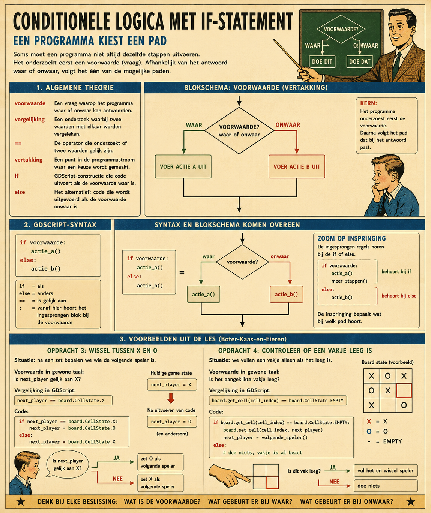

# Les 1. Input, state en output

## Systeemdenken

**Systeemdenken** is een manier om naar onderdelen, relaties en gedrag als één geheel te kijken.
Programmeren is daar een concrete toepassing van: een programma bestaat uit samenwerkende delen die
informatie verwerken en op veranderingen reageren. Door zulke algemene patronen te leren herkennen,
wordt het makkelijker om nieuwe programma’s te begrijpen, problemen op te delen en dezelfde ideeën
later in andere situaties opnieuw te gebruiken.

Een **systeem** is iets dat informatie ontvangt, onthoudt en daarop reageert. De **grens** bepaalt
wat bij het systeem hoort en wat van buiten komt. Alles wat het systeem binnenkomt, heet **input**.
Informatie die het systeem tussen momenten bewaart, heet **state**. Wat het systeem zichtbaar of
merkbaar naar buiten brengt, heet **output**. Veel programma’s kunnen worden begrepen als een
eenvoudige kringloop: input komt binnen, de state verandert en daardoor ontstaat nieuwe output.

Om deze begrippen te leren gebruiken, gaan we in de eerste lessen werken met het spel
**boter-kaas-en-eieren**. Het speelbord vormt daarbij een klein en overzichtelijk systeem. Een klik
op een vakje is input, de toestand van de vakjes is state en wat er op het bord zichtbaar wordt, is
output. De spelregels bouwen we stap voor stap op, zodat we telkens kunnen onderzoeken hoe input,
state en output met elkaar samenhangen.



## De gegeven spelbasis

Voordat we zelf spelregels schrijven, krijgen we een werkende spelbasis. Deze basis zorgt ervoor
dat het speelbord zichtbaar is en dat een klik op een vakje bij ons script terechtkomt. Wij hoeven
voor deze les niet te onderzoeken hoe Godot knoppen tekent of hoe signalen precies worden verbonden.
Die onderdelen zijn al voor ons klaargezet. Daardoor kunnen we ons richten op de vraag: wat moet het
systeem doen nadat het een klik als input heeft ontvangen?

### De scene

De game bestaat uit één scene. De *root* heet `Game`. Daaronder staat `Board`, een raster met drie
kolommen. In het raster staan negen knoppen: `Cell_1` tot en met `Cell_9`.

```text
Game
└── Board
	├── Cell_1
	├── Cell_2
	├── Cell_3
	├── Cell_4
	├── Cell_5
	├── Cell_6
	├── Cell_7
	├── Cell_8
	└── Cell_9
<details>
<summary>Voorbeeldoplossing</summary>

```gdscript
```

Elke knop stelt één vakje voor. Een leeg vakje toont zijn *index*, dus bijvoorbeeld `1` of `9`.
Later kunnen we een vakje veranderen in `X` of `O`.

Een *root* is in informatica het bovenste onderdeel van een structuur. Andere onderdelen hangen
onder de root. In deze scene is `Game` de root; `Board` en de negen knoppen zijn onderdelen daaronder.

Een *index* is een nummer waarmee je een onderdeel uit een reeks kunt aanwijzen. In veel
programmeertalen beginnen indexen bij 0 in plaats van bij 1. In dit spel zou dat onhandig zijn,
omdat het cijfer `0` lijkt op de letter `O`, die we gebruiken voor een speler. Daarom begint de
`cell_index` van de vakjes hier bij 1 en loopt die van 1 tot en met 9. Zo verwijst `cell_index` `1`
naar het eerste vakje en `cell_index` `9` naar het laatste vakje.

### Twee scripts

De scene gebruikt twee scripts met elk een eigen verantwoordelijkheid.

`board.gd` verzorgt de infrastructuur van het speelbord. Het script weet welke knoppen bij het bord
horen, vertaalt een klik naar een `cell_index` en zorgt ervoor dat de toestand van een vakje zichtbaar
kan worden gemaakt. `board.gd` bevat dus geen spelregels zoals "wie is aan de beurt?" of "wie heeft
gewonnen?".

`game.gd` is het script waarin de spelregels komen. Het ontvangt de klik via
`on_cell_clicked(cell_index)`. In het begin doet deze functie nog niets met de klik behalve het
nummer zichtbaar afdrukken. In de oefeningen voegen we stap voor stap gedrag toe aan dit script.

## De Board API

Een **API** is een afgesproken manier waarop je een onderdeel van een programma kunt gebruiken. Je
hoeft dan niet te weten hoe dat onderdeel intern is gebouwd. Je hoeft alleen te weten welke namen,
invoer en resultaten beschikbaar zijn.

Het bord heeft daarom een kleine publieke API. Vanuit `game.gd` gebruiken we alleen deze onderdelen:

```text
board.CellState.EMPTY
board.CellState.X
board.CellState.O

board.get_cell(cell_index)
board.set_cell(cell_index, state)
```

`CellState` beschrijft de drie mogelijke toestanden van een vakje: leeg, `X` of `O`.
`get_cell(cell_index)` leest de toestand van een vakje. `set_cell(cell_index, state)` verandert de
toestand van een vakje en werkt de zichtbare tekst op het bord bij. Een bestaande toestand mag daarbij
worden overschreven. Het bord controleert niet of dat volgens de spelregels verstandig is; die
beslissing hoort bij `game.gd`.

### Privéonderdelen

In Godot begint de naam van een privéfunctie volgens de gebruikelijke conventie met een underscore,
bijvoorbeeld `_set_empty_style()`, `_set_filled_style()` en `_ready()`. Zo'n naam geeft aan dat de
functie bedoeld is voor de interne werking van het script en niet voor gebruik vanuit een ander
script.

`board.gd` heeft zulke privéonderdelen voor de opmaak van lege en ingevulde vakjes en voor het
aansluiten van de knoppen. Je hoeft daar nu niet naar te kijken en je hoeft deze functies niet te
gebruiken. Ze vallen buiten de scope van de leerdoelen van deze les. Gebruik voor het bord alleen de
publieke API hierboven en schrijf de spelregels in `game.gd`.

## Opdrachten

De opdrachten bouwen stap voor stap voort op elkaar. Probeer iedere opdracht eerst zelf op te
lossen. De voorbeelden onderaan elke opdracht zijn oplossingen die je kunt bekijken wanneer je
vastloopt of je eigen oplossing wilt vergelijken. Houd de Godot-editor tijdens het werken op één
scherm open en zet deze les op een tweede scherm. Zo kun je de opdracht lezen terwijl je de code in
Godot aanpast en het resultaat meteen uitproberen.

De codevoorbeelden zijn open diff-fragmenten. Ze tonen alleen wat er ten opzichte van de vorige stap
verandert. Een diff is bedoeld om goed te bekijken en over te typen; het is geen compleet script dat
je direct kunt kopiëren.

### Opdracht 1. Plaats altijd een X

We beginnen met de gegeven spelbasis. Het speelbord is zichtbaar en je kunt op alle vakjes klikken.
De klik komt aan bij de functie `on_cell_clicked(cell_index)`. Het nummer van het aangeklikte vakje
verschijnt in de uitvoer door `print()`, maar verder gebeurt er nog niets met de klik. De board state
verandert nog niet: een leeg vakje blijft zijn nummer tonen.

De functie `on_cell_clicked(cell_index)` ontvangt dus al input, maar gebruikt die input nog niet om
het spel te veranderen. In deze opdracht voegen we de eerste spelregel toe: na iedere klik vullen we
het aangeklikte vakje met `X`. Om dat te doen gebruiken we de Board API. We moeten met name de functie
`board.set_cell()` aanroepen.

Een *functie* is een benoemd stukje programma dat je kunt aanroepen om iets te laten gebeuren. Je
kunt een functie bekijken als een klein systeem met input, state en output. Het uitvoeren van de code
van een functie noemen we de functie *aanroepen*. De waarden die je bij het aanroepen meegeeft, heten
*argumenten* en vormen de input. Een functie kan een waarde teruggeven; die waarde heet de
*returnwaarde* en vormt de output. Een functie kan ook de state van een ander onderdeel veranderen,
bijvoorbeeld door een vakje te vullen.

Een functie hoeft niet altijd alle drie de begrippen te hebben. Ze kan geen argumenten ontvangen en
daarmee geen input hebben. Ze kan ook geen returnwaarde geven; in GDScript noemen we het resultaat
dan `void`. En een functie hoeft de state niet aan te raken of te veranderen: ze kan alleen de input
verwerken en daaruit een output berekenen.

De Board API biedt de functie `set_cell()`. Deze functie ontvangt een `cell_index` en een toestand als
input. Vervolgens verandert ze de *board state*: de toestand van het bijbehorende vakje. Je leest en
verandert de board state via de `board`-variabele. Daarna maakt `set_cell()` die verandering zichtbaar
op het bord. De functie heeft geen returnwaarde, want ze geeft niets terug.



**Opdracht:** pas de functie `on_cell_clicked(cell_index)` in `game.gd` aan. Gebruik in deze functie
de functie `board.set_cell()` om de *board state* van het aangeklikte vakje te veranderen. Geef
`cell_index` door als eerste argument, zodat `set_cell()` weet welk vakje moet veranderen. Geef
`board.CellState.X` door als tweede argument, zodat de functie een `X` in dat vakje plaatst. Zorg
ervoor dat na iedere klik een `X` verschijnt in het aangeklikte vakje.

**Voorbeeld van de wijziging:**

```diff
func on_cell_clicked(cell_index: int) -> void:
	print("Clicked cell: ", cell_index)
+	board.set_cell(cell_index, board.CellState.X)
```

#### Controlevragen

1. Welke input ontvangt `on_cell_clicked(cell_index)`? Noem ook de waarde die in
	`cell_index` terechtkomt.
2. Welke *board state* verandert wanneer de functie `board.set_cell()` aanroept? Welk vakje krijgt
	welke toestand?
3. Welke output ontstaat er? Kijk naar wat de speler op het bord kan zien en naar wat met `print()`
	in de uitvoer verschijnt.
4. Zijn input, board state en output alle drie van toepassing op `on_cell_clicked()`? Leg je antwoord
	uit.
5. Geeft `on_cell_clicked()` zelf een returnwaarde? Hoe zie je dat in de functiedefinitie?

### Opdracht 2. Bewaar wie aan de beurt is

In opdracht 1 wordt de waarde `board.CellState.X` rechtstreeks aan `set_cell()` meegegeven. Daarom
verschijnt na iedere klik een `X`. Het programma onthoudt nog niet welk teken voor de volgende zet
bedoeld is. De toestand van het spel bevat nog geen eigen variabele die dat kan onthouden.

Daarom voegen we een *variabele* toe. Een variabele is een naam waaronder een programma een waarde
bewaart. Die waarde kan later worden uitgelezen en blijft beschikbaar zolang de variabele bestaat.
Een variabele is daarmee een eenvoudige vorm van state: het programma onthoudt iets tussen twee
momenten.

In GDScript bepaalt de plaats waar je een variabele schrijft in welke *scope* de variabele bestaat.
Een variabele die buiten alle functies in een script staat, heeft *script scope*. Zo'n variabele is
een *membervariabele* van het node: alle functies van dat script kunnen haar gebruiken en haar waarde
blijft tussen functieaanroepen bewaard. In `game.gd` is `board` zo'n membervariabele. De regel
`@onready var board = $Board` bewaart een verwijzing naar de Board-node, zodat functies in `game.gd`
de publieke Board API kunnen aanroepen met bijvoorbeeld `board.set_cell()`.

De eigen membervariabelen van het `game.gd`-script vormen de *game state*: de informatie die het
spel zelf onthoudt. In deze opdracht voegen we `next_player` toe aan die game state. De variabele
`board` is daar ook een onderdeel van: zij bewaart een verwijzing naar de Board-node. Via `board`
kunnen we de board state lezen en veranderen.

Omdat `board` een membervariabele van `Game` is, kun je de board state ook zien als een onderdeel van
de game state. Toch houden we de begrippen uit elkaar. Die scheiding helpt ons om
verantwoordelijkheden te scheiden: `board.gd` beheert de board state en `game.gd` beheert de
spelregels en de game state.




**Opdracht:** maak een variabele met de naam `next_player` in de script scope van `game.gd`. Deze
variabele wordt een onderdeel van de *game state*. Geef haar de waarde `board.CellState.X`. Laat
`set_cell()` deze game-statewaarde gebruiken om de board state van het aangeklikte vakje te vullen,
in plaats van de toestand rechtstreeks in de functie te schrijven. Verander `next_player` nog niet.
Daardoor verandert het gedrag van het spel in deze opdracht nog niet: na iedere klik verschijnt nog
steeds een `X`, net als in opdracht 1.

De implementatie verandert wel. De game state wordt nu via `next_player` gebruikt om de board state
te vullen, in plaats van de toestand rechtstreeks als argument aan `set_cell()` te schrijven. In
opdracht 3 gaan we `next_player` na iedere zet wel veranderen, zodat de game state verandert en de
spelers kunnen wisselen.

**Voorbeeld van de wijziging:**

```diff
+var next_player = board.CellState.X

func on_cell_clicked(cell_index: int) -> void:
	print("Clicked cell: ", cell_index)
-	board.set_cell(cell_index, board.CellState.X)
+	board.set_cell(cell_index, next_player)
```

### Opdracht 3. Wissel tussen X en O

In opdracht 2 hebben we ervoor gezorgd dat de *game state*, namelijk `next_player`, wordt gebruikt
om de board state van een vakje te vullen. De waarde van `next_player` verandert daar nog niet.
Daarom wordt na iedere klik steeds een `X` ingevuld. De game state wordt wel gebruikt, maar blijft
altijd dezelfde waarde houden.

In deze opdracht gaan we de game state na iedere zet veranderen. Na een zet moet `next_player` een
andere waarde bevatten, zodat de volgende zet door de andere speler wordt gedaan. De board state
wordt eerst gevuld met de huidige waarde van `next_player`; daarna veranderen we de game state voor
de volgende zet.

Een *voorwaarde* is een
vraag waarop het programma `waar` of `onwaar` kan antwoorden. Met een `if` voert het programma code
uit afhankelijk van zo'n voorwaarde.

Om te bepalen welke speler aan de beurt is, gebruiken we een *vergelijking operator* `==`. Het
onderzoekt of twee waarden gelijk zijn. Het resultaat is `waar` of `onwaar`. In `next_player ==
board.CellState.X` vergelijken we de huidige waarde van `next_player` met de toestand `X`.

In dit spel is de voorwaarde: is `next_player` op dit moment `X`? Als dat zo is, wordt de volgende
toestand `O`; anders wordt de volgende toestand `X`.




**Opdracht:** laat het programma na iedere klik wisselen tussen `X` en `O`. Gebruik een `if` en pas
de game state, dus `next_player`, aan nadat de board state met het teken is bijgewerkt.

**Voorbeeld van de wijziging:**

```diff
var next_player = board.CellState.X

func on_cell_clicked(cell_index: int) -> void:
	print("Clicked cell: ", cell_index)
	board.set_cell(cell_index, next_player)
+	if next_player == board.CellState.X:
+		next_player = board.CellState.O
+	else:
+		next_player = board.CellState.X
```

### Opdracht 4. Controleer of een vakje leeg is

Na opdracht 3 kunnen we de board state van ingevulde vakjes overschrijven. Dat viel eerst niet op, omdat ieder vakje
steeds met een `X` werd ingevuld. Nu wisselen de spelers tussen `X` en `O`. Als je steeds hetzelfde
vakje aanklikt, zie je daardoor dat het vakje afwisselend `X` en `O` wordt.

Dat willen we oplossen door naar de board state te kijken, en vooral naar de board state van het
specifieke aangeklikte vakje. We mogen de board state van een vakje alleen vullen als het nog niet gevuld is. Dat
betekent dat de waarde van het vakje `board.CellState.EMPTY` moet zijn. De Board API kan met
`get_cell(cell_index)` de board state van dat specifieke vakje teruggeven. Daarna gebruiken we dezelfde
vergelijking operator als in de vorige opdracht: `==`. De vergelijking zelf is anders: nu
vergelijken we de toestand van het vakje met `board.CellState.EMPTY`.

**Opdracht:** gebruik `get_cell()` om de board state van het aangeklikte vakje te lezen en gebruik
een `if`-voorwaarde. Plaats alleen een teken op een leeg vakje. Wissel daarna alleen van speler als
er daadwerkelijk een teken in de board state is geplaatst. De game state `next_player` mag dus niet
veranderen wanneer het aangeklikte vakje al gevuld is.

**Voorbeeld van de wijziging:**

```diff
var next_player = board.CellState.X

func on_cell_clicked(cell_index: int) -> void:
	print("Clicked cell: ", cell_index)
+	if board.get_cell(cell_index) == board.CellState.EMPTY:
+		board.set_cell(cell_index, next_player)
+		if next_player == board.CellState.X:
+			next_player = board.CellState.O
+		else:
+			next_player = board.CellState.X
```

### Opdracht 5. Reageer op een foute zetpoging

In opdracht 4 controleert het programma al of een vakje leeg is. Als het vakje gevuld is, gebeurt
er alleen niets. Voor de speler is dat onduidelijk: na een klik krijgt die geen teken en geen uitleg.
Daarom voegen we in deze opdracht een reactie toe voor deze bijzondere toestand. Wanneer de speler
op een gevuld vakje klikt, printen we een klacht in de uitvoer.

De spelregel die bepaalt of een zet geldig is, hoort bij `game.gd`. Ook de reactie op een ongeldige
zet hoort daarom bij `game.gd`. In een echt spel zou je deze boodschap waarschijnlijk zichtbaar in
de game scene tonen, bijvoorbeeld naast het bord. Dat valt buiten de scope van deze les. We gebruiken
nu `print()` als eenvoudige output, zodat je kunt zien dat het programma de foute zetpoging herkent.

Bij een `if`/`else`-constructie is het een bruikbare conventie om de *happy path* in het `waar`-pad
te zetten. De happy path is de normale situatie waarin alles goed gaat en de hoofdtaak kan worden
uitgevoerd. In deze opdracht is dat: het vakje is leeg, dus we plaatsen een teken en wisselen van
speler. De bijzondere toestand zetten we in het `onwaar`-pad van `else`: het vakje is al gevuld, dus
we klagen en doen verder niets met de beurt.

**Opdracht:** voeg een `else` toe aan de controle van opdracht 4. Gebruik in dat `else` een
`print()`-aanroep die duidelijk maakt dat de speler op een gevuld vakje heeft geklikt. De board state
en de game state mogen bij zo'n foute zetpoging niet veranderen.

**Voorbeeld van de wijziging:**

```diff
var next_player = board.CellState.X

func on_cell_clicked(cell_index: int) -> void:
	print("Clicked cell: ", cell_index)
	if board.get_cell(cell_index) == board.CellState.EMPTY:
		board.set_cell(cell_index, next_player)
		if next_player == board.CellState.X:
			next_player = board.CellState.O
		else:
			next_player = board.CellState.X
+	else:
+		print("This cell is already filled.")
```

### Opdracht 6. Tel de zetten

In de vorige opdrachten bevatte de game state al de variabele `next_player`. In deze opdracht voegen
we nog een stukje game state toe: `move_count`. Deze variabele onthoudt hoeveel geldige zetten er
zijn gedaan. Een foute zetpoging telt dus niet mee, omdat er dan geen teken op het bord wordt
geplaatst.

**Opdracht:** maak in de script scope een variabele met de naam `move_count` en geef haar als
beginwaarde `0`. Verhoog `move_count` na iedere geldige zet. Print daarna de nieuwe waarde, zodat je
in de uitvoer kunt zien hoeveel geldige zetten er zijn gedaan.

Om een variabele met één te verhogen, schrijven we:

```gdscript
move_count += 1
```

De operator `+=` betekent: tel de waarde rechts op bij de waarde links en bewaar het resultaat weer
in de variabele links. `move_count += 1` is dus een korte schrijfwijze voor
`move_count = move_count + 1`. Het verhogen van een waarde noemen we *increment*. `+= 1` is daarom
een increment van één.

**Voorbeeld van de wijziging:**

```diff
var next_player = board.CellState.X
+var move_count = 0

func on_cell_clicked(cell_index: int) -> void:
	print("Clicked cell: ", cell_index)
	if board.get_cell(cell_index) == board.CellState.EMPTY:
		board.set_cell(cell_index, next_player)
		if next_player == board.CellState.X:
			next_player = board.CellState.O
		else:
			next_player = board.CellState.X
+		move_count += 1
+		print("Move count: ", move_count)
	else:
		print("This cell is already filled.")
```

## Vooruitblik: de volgende les

In deze les hebben we geleerd hoe input, state en output samen het gedrag van het spel vormen. De
spelers kunnen zetten doen, het programma onthoudt wie aan de beurt is en het bord laat de zetten
zien. Het spel weet alleen nog niet wanneer een partij voorbij is.

In de volgende les breiden we het spel uit met de volgende stappen:

1. Het programma herkent wanneer een speler heeft gewonnen. Daarvoor onderzoeken we de toestanden
	van de vakjes op het bord en controleren we de mogelijke winnende rijen.
2. Het programma maakt duidelijk op het spelbord dat de partij is afgelopen. De speler kan dan zien
	wie heeft gewonnen en dat er geen nieuwe zetten meer bij deze partij horen.
3. Na een afgelopen partij kunnen we een nieuwe ronde beginnen. De oude zetten worden verwijderd,
	de spelers beginnen opnieuw en de game state krijgt weer de beginwaarden.
4. We voegen ook een reset toe. Die kan worden gebruikt na een game-over, maar ook midden in een
	partij wanneer de spelers opnieuw willen beginnen voordat iemand heeft gewonnen.

Een reset betekent dat de relevante game state en board state teruggaan naar hun beginsituatie. Het
bord wordt weer leeg, `next_player` begint opnieuw bij de eerste speler en `move_count` wordt weer
`0`. Zo wordt duidelijk dat een nieuwe ronde een nieuwe toestand van het spel is en niet simpelweg
een voortzetting van de vorige partij.

